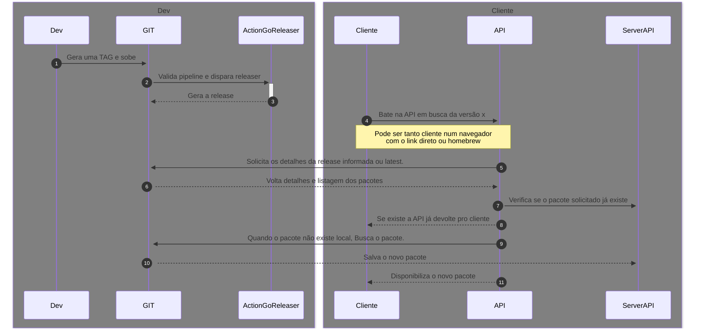

# MGC CLI Releaser

## about VM:
- basic bs1.xsmall - only 80:443 opened 

- installed docker with compose [docker](https://docs.docker.com/engine/install/ubuntu/) + [compose](https://www.digitalocean.com/community/tutorials/how-to-install-and-use-docker-compose-on-ubuntu-20-04) + [permission](https://stackoverflow.com/questions/48957195/how-to-fix-docker-got-permission-denied-issue)

- installed nginx [install](https://ubuntu.com/tutorials/install-and-configure-nginx#2-installing-nginx)

- installed certbot to provide https [install](https://certbot.eff.org/instructions?ws=nginx&os=ubuntufocal)


## resources:
- registry (harbor)

- golang

- github API

## how to run:
- configure and install the docker, docker compose, nginx.
- create `docker-compose.yaml` with this:
```
version: "3.5"
services:
  api01: &api
    image: registry.geff.ws/test-goreleaser/releaser:v0.3.6
    container_name: api01
    ports:
      -  8080:8080
    environment:
      - GIT_PERSONAL_TOKEN=your token
      - GIT_OWNER_PROJECT=yourGit/yourProject
      - SERVER_PORT=8080
      - SERVER_IP=0.0.0.0
      - SERVER_URL=test.geff.ws
    volumes:
            - ./downloads:/app/downloads
    deploy:
      resources:
        limits:
          cpus: "0.35"
          memory: "50mb"
    restart: always

  api02:
    <<: *api
    container_name: api02
    ports:
      -  8081:8080

networks:
  default:
    driver: bridge
    name: test-releaser

```
- create the `downloads` directory at same place of `docker-compose.yaml`
- just run `docker-compose up -d`
- in this repo contains my `nginx.conf`, so u can do same thing i did.
- another configs?... use google please.

## endpoints

- https://test.geff.ws/download/cli/{version} to get an list of files

- https://test.geff.ws/download/cli/{version}/{so-arch} to download package

### examples: 
-   https://test.geff.ws/download/cli/latest

-   [https://test.geff.ws/download/cli/0.1.0/darwin_arm64.tar.gz](http://test.geff.ws/download/cli/0.1.0/darwin_arm64.tar.gz") to download the package of version 0.1.0

-   [http://test.geff.ws/download/cli/latest/darwin_arm64.tar.gz"](http://test.geff.ws/download/cli/latest/darwin_arm64.tar.gz") to download the package of de latest version

## diagram:

